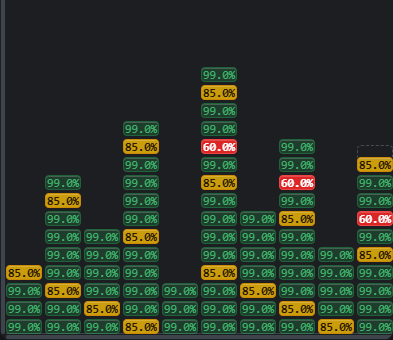
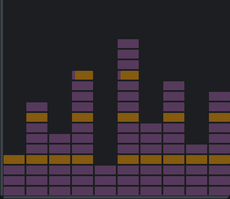

# Cache Bricks for DeepSeek Harness

**DeepSeek Harness 的缓存命中率与模型请求活动可视化插件。** 每次真实模型请求对应一块砖：查看缓存读数、打开请求详情，并定位到对应对话。

**当前推荐：完整版 v0.1.4。** 默认分支 `main` 提供完整功能。

[下载完整版](https://github.com/3289192-bot/dsh-cache-bricks/releases/tag/v0.1.4) · [安装](#安装) · [更新说明](https://github.com/3289192-bot/dsh-cache-bricks/releases/latest) · [反馈问题](https://github.com/3289192-bot/dsh-cache-bricks/issues)

Cache Bricks is a DeepSeek Harness web plugin for prompt-cache hit-rate visualization and model-request inspection. The default `main` branch ships the full edition, with request details, comparison, conversation navigation, an activity view, and paged history.

| 项目 | 说明 |
| --- | --- |
| 插件包名 | `dsh-cache-bricks` |
| 默认发行版 | 完整版 `v0.1.4`，分支 `main` |
| 支持环境 | **仅 DeepSeek Harness `0.1.7-rc.2`，Web profile** |
| 安装来源 | GitHub，已包含构建产物，无需本机编译 |
| 开源协议 | [MIT](LICENSE) |

## 能做什么

| 功能 | 用途 |
| --- | --- |
| 缓存棋盘 | 在对话旁按轮次堆叠请求砖，直观看到每次请求的缓存命中率变化 |
| 请求详情 | 单击砖块，按可用记录查看对话、缓存与 token 用量、耗时、工具调用、重试及错误 |
| 对话定位 | 双击砖块或点击面板定位按钮，跳到对应对话行；目标实际可见才报告成功 |
| 请求对比 | 对比两次请求的记录，帮助排查缓存读数或请求内容的变化 |
| 活动翻面 | 将同一棋盘切换为请求活动视图，区分模型输出、思考和工具调用等活动 |
| 历史回看 | 横向、纵向滚动棋盘，按当前视图加载历史，并可一键回到最新位置 |

一块砖对应一次模型请求 attempt，重试会产生另一块砖。宿主采集不可用时，降级记录按 step 折叠，并明确标为估算。插件用于观察已有请求，不修改模型请求或提示词。

## 界面预览

| 缓存命中率 | 请求活动视图 |
| --- | --- |
|  |  |

截图由 0.1.2 构建产物使用合成请求生成，展示沿用至本版的棋盘外观，不含私人会话文字。

## 安装

**先确认 DeepSeek Harness 版本为 `0.1.7-rc.2`，并使用 Web profile。** 当前支持范围限定为此版本。

```sh
dsh plugin --profile web add github:3289192-bot/dsh-cache-bricks#v0.1.4
```

也可[下载完整版安装包](https://github.com/3289192-bot/dsh-cache-bricks/releases/download/v0.1.4/dsh-cache-bricks-0.1.4.tgz)，再将下面的路径替换为本地文件路径：

```sh
dsh plugin --profile web add file:/path/to/dsh-cache-bricks-0.1.4.tgz
```

安装后重启 DSH Web 服务并刷新页面。若同一 profile 曾安装旧包 `dsh-cache-badge`，先执行 `dsh plugin --profile web remove dsh-cache-badge`，避免出现两套棋盘。

卸载本插件：

```sh
dsh plugin --profile web remove dsh-cache-bricks
```

## 如何读缓存颜色

命中率按 `缓存读取 token / (未缓存输入 + 缓存读取 + 缓存写入)` 计算。

| 颜色 | 含义 |
| --- | --- |
| 绿色 | 命中率 ≥ 90% |
| 黄色 | 70% ≤ 命中率 < 90% |
| 红色 | 命中率 < 70% |
| 灰色 | 提供方未报告缓存字段，或 prompt 小于 1000 token |

未报告缓存字段时显示 `n/a`；读数保留一位小数并向下取整。颜色表达当前请求的缓存读取比例，不直接断言缓存下降的原因。

## 数据与使用边界

- 插件读取本机 DSH 的请求观测记录和会话日志，完整版本可能展示其中的请求、对话与工具内容。
- 插件采集内容保存在进程内存中，通过受保护的本机接口提供给界面；插件自身不将这些内容写入磁盘，也没有第三方上传或分析端点。DSH 原有会话日志由宿主管理。
- 重启会清空内存中的采集内容；历史回看能恢复的字段以会话日志实际记录为准。
- 定位依赖宿主加载并渲染目标行；未找到或仍不可见时会报告状态。对话旁空白不足时，棋盘会隐藏。

## 文档与开发

[砖块与数据定义](docs/brick-contract.md) · [历史加载设计](docs/history-scene.md) · [运行时接口](docs/runtime-contract.md) · [验证记录](docs/verification.md)

```sh
pnpm install --frozen-lockfile
pnpm run typecheck
pnpm run build
pnpm test
```

## 可选精简版

<details>
<summary>Lite：只需要缓存棋盘时选择</summary>

`v0.1.4-lite` 是可选精简版，源码在 [`lite` 分支](https://github.com/3289192-bot/dsh-cache-bricks/tree/lite)。保留缓存读数、颜色提示、棋盘滚动和打开旧会话时的记录补载；省去详情面板、请求对比、对话定位与活动翻面。

默认推荐上方的完整版。两个版本共用包名 `dsh-cache-bricks`，同一 profile 选择一个安装；Lite 同样仅支持 DSH `0.1.7-rc.2` Web profile。

[下载 Lite](https://github.com/3289192-bot/dsh-cache-bricks/releases/download/v0.1.4/lite-dsh-cache-bricks-0.1.4.tgz)

```sh
dsh plugin --profile web add github:3289192-bot/dsh-cache-bricks#v0.1.4-lite
```

</details>
