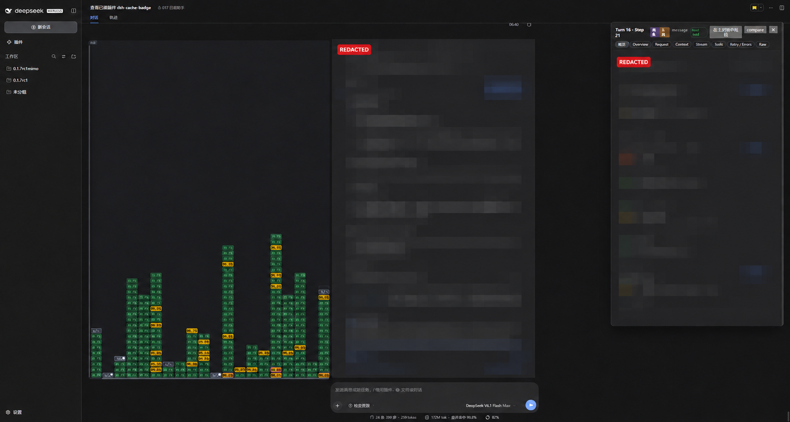
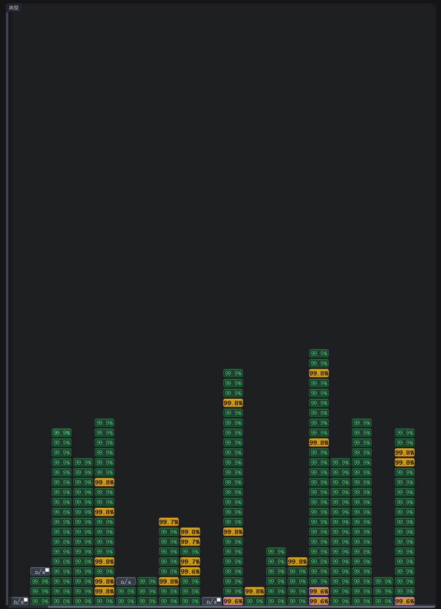
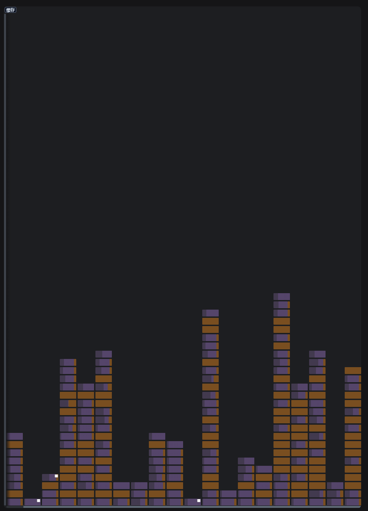
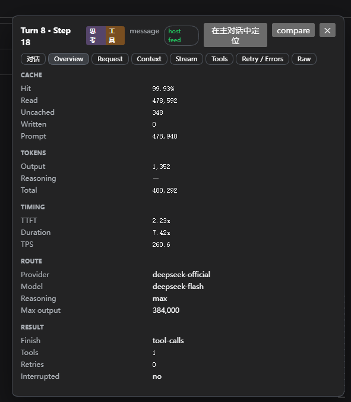

# Cache Bricks for DeepSeek Harness

A local DSH web plugin that turns model request attempts into a falling-brick board. The front shows prompt-cache health; the reverse shows request activity.

中文：把每次真实模型请求画成一块砖，正面看缓存命中，翻面看请求类型与结局；点击可查看请求记录，双击可定位到对话原文。

## Screenshots / 截图

**Conversation view** — private transcript and inspector text are pixelated and marked `REDACTED`.



**Cache rate / Activity type**





**Attempt details**



The installable package is `dsh-cache-badge`; this GitHub repository is `dsh-cache-bricks`.

## Features

- One brick for each real model request attempt, including retries.
- Cache hit rate on the front; request type and outcome on the reverse.
- Click a brick to inspect its request record. Double-click to locate the corresponding conversation row.
- Large request and event payloads are content-addressed and deduplicated in the DSH plugin store.

## Install / 安装

```powershell
dsh plugin --profile web add github:3289192-bot/dsh-cache-bricks
```

To uninstall / 卸载：

```powershell
dsh plugin --profile web remove dsh-cache-badge
```

The repository includes the built `lib/` files, so GitHub installation does not need to run a package build script.

## Compatibility / 兼容性

- Runtime notes cover DSH `0.1.7-rc.2`; the plugin targets the web profile.
- The package manifest declares DSH client package compatibility from `0.1.6-alpha.1` up to, but not including, `0.1.8`.

## Data and permissions / 数据与权限

The plugin observes model requests, streams, tool calls/results, and conversation events. Captured records stay in the DSH process memory and are served through its guarded local API; they are not persisted to disk by the plugin and are cleared when the process exits. The default limits are 8 sessions and 48 MiB of raw payloads, with eviction at capacity. Prompts and tool content may be sensitive. The source has no analytics or third-party upload endpoint.

插件会读取模型请求、流、工具调用/结果和对话事件。采集记录只保存在 DSH 进程内存中，并通过受保护的本机 API 提供给界面；插件不会将这些记录写入磁盘，进程退出后记录会清空。默认最多保留 8 个会话和 48 MiB 原始内容，达到上限会淘汰旧数据。提示词和工具内容可能敏感；源码没有分析服务或第三方上传接口。

## Known limitations in 1.7.1 / 已知限制

- The final real-device `verify:ui` run for frozen 1.7.1 was stopped before completion; see [verification notes](docs/verification.md).
- Some interface labels mix Chinese and English.
- DSH prerelease APIs may change between versions.

- 冻结版 1.7.1 的最后一次真机 `verify:ui` 未跑完，详见[验证记录](docs/verification.md)。
- 部分界面标签中英混用。
- DSH 预发布接口可能随版本变化。

## Project notes / 项目资料

- [Brick data contract](docs/brick-contract.md)
- [Verification notes](docs/verification.md)
- [Technical design](docs/technical-design.md)

This project was derived from [`wefio/dsh-cache-miss`](https://github.com/wefio/dsh-cache-miss). The original MIT notice is retained in [LICENSE](LICENSE).
